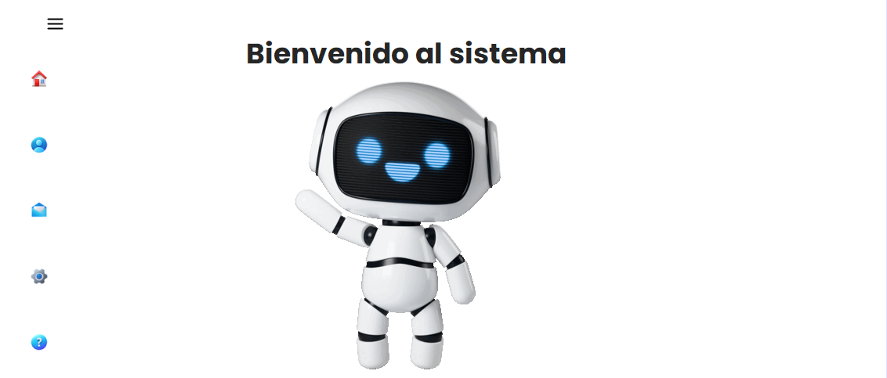
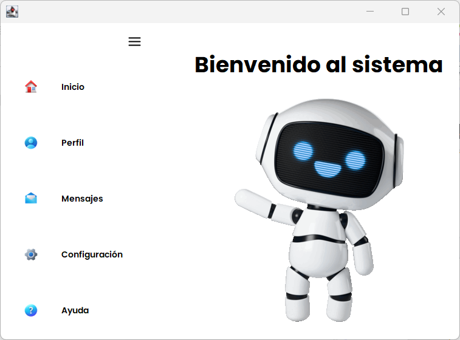
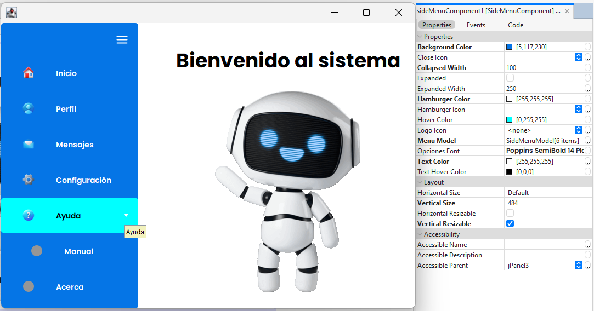

# Componente Menu Lateral

<p align="center">
  
</p>

<p align="center">
  <a href="#descripción">Descripción</a> •
  <a href="#capturas-de-pantalla">Capturas</a> •
  <a href="#características-principales">Características</a> •
  <a href="#métodos-principales">Métodos</a> •
  <a href="#instrucciones-de-uso">Uso</a> •
  <a href="#créditos">Créditos</a>
</p>

## Descripción

Componente de menú lateral personalizable desarrollado en Java. Este componente permite agregar y eliminar opciones desde un editor personalizado que ofrece agregar, eliminar, subir y bajar
opciones, así como agregar hijos a cada opción. Además, cuenta con un método que permite agregar un ActionListener a cada opción.

## Capturas de Pantalla

<div align="center">
  
</div>

<div align="center">
  
</div>

## Características Principales

- ✨ **Animación** en la apertura y cierre del menú
- 🎨 **Personalización completa** de colores, iconos y fuentes
- 📱 **Diseño** adaptable a diferentes tamaños de ventana
- 🧩 **Integración sencilla** con cualquier proyecto Java
- 🔒 **Editor personalizado del modelo** para editar las propiedades de las opciones

## Métodos Principales

A continuación se muestran algunos de los métodos más relevantes del componente:

### Buscar un ítem por su texto en todo el modelo (incluyendo ítems anidados)

```java
/**
 * Busca el item (SideMenuItem) dentro del modelo con texto Inicio, regresa null si no lo encuentra 
 */
menuLateral.getMenuItem("Inicio");
```

### Ocultar o deshabilitar una opción

```java
itemInicio.setEnabled(false); // Deshabilita el item Inicio
itemInicio.setShown(false); // Oculta el item Inicio
```
> [!NOTE]
> Si un item se deshabilita este se torna de color gris.

### Buscar un ítem por su texto y asignarle una acción.

```java
/**
 * Busca el item del menú lateral con el texto "Mensajes"
 * si el item y le asigna un ActionListener
 * para mostrar la ventana 'ventanaMensaje' cuando se hace click en él.
 */
menuLateral.setMenuItemAction("Mensajes", e -> {
    ventanaMensaje.setVisible(true);
});
```

> [!NOTE]
> Los items tienen su método `setActionListener(ActionListener actionListener)`, por lo que si tienes una instancia de `SideMenuItem` puedes directamente invocar dicho método en él.

## Instrucciones de Uso

### Integración

1. **Añade el componente a tu proyecto**

   Puedes clonar este repositorio e importar las clases necesarias a tu proyecto:

   ```bash
   git clone https://github.com/fergmlx/componente-menu-lateral.git
   ```

   O añadir el JAR compilado a tus dependencias.

2. **Inicializa el componente en tu aplicación**

   ```java
   import menulateral.*;
    import javax.swing.*;
    import java.awt.*;
    
    public class EjemploMenuLateral extends JFrame {
    
        public EjemploMenuLateral() {
            // Configurar ventana
            setTitle("Ejemplo SideMenu");
            setSize(800, 600);
            setDefaultCloseOperation(JFrame.EXIT_ON_CLOSE);
            
            // Crear el panel principal con BorderLayout
            JPanel mainPanel = new JPanel(new BorderLayout());
            
            // Crear e inicializar el SideMenuComponent
            SideMenuComponent menuLateral = new SideMenuComponent();
            menuLateral.setBackgroundColor(new Color(40, 40, 40));
            menuLateral.setHoverColor(new Color(220, 220, 220));
            menuLateral.setTextColor(Color.WHITE);
            
            // Crear elementos principales
            SideMenuItem itemInicio = new SideMenuItem("Inicio", "icons/home.png");
            
            // Crear elemento con submenús
            SideMenuItem itemConfig = new SideMenuItem("Configuración", "icons/config.png");
            
            // Agregar hijos al elemento de configuración
            SideMenuItem subItemPerfil = new SideMenuItem("Perfil de Usuario", "icons/user.png");
            SideMenuItem subItemSeguridad = new SideMenuItem("Seguridad", "icons/security.png");
            SideMenuItem subItemNotificaciones = new SideMenuItem("Notificaciones", "icons/notify.png");
            
            // Agregar subítems al ítem padre
            itemConfig.addChild(subItemPerfil);
            itemConfig.addChild(subItemSeguridad);
            itemConfig.addChild(subItemNotificaciones);
            
            // Expandir el menú de configuración
            itemConfig.setExpanded(true);
            
            // Agregar elementos al menú
            menuLateral.addMenuItem(itemInicio);
            menuLateral.addMenuItem(new SideMenuItem("Mensajes", "icons/message.png"));
            menuLateral.addMenuItem(new SideMenuItem("Calendario", "icons/calendar.png"));
            menuLateral.addMenuItem(itemConfig); // Elemento con submenús
            menuLateral.addMenuItem(new SideMenuItem("Ayuda", "icons/help.png"));
            
            // Crear panel central como ejemplo
            JPanel centerPanel = new JPanel();
            centerPanel.setBackground(Color.WHITE);
            centerPanel.add(new JLabel("Contenido Principal"));
            
            // Añadir componentes al panel principal
            mainPanel.add(menuLateral, BorderLayout.WEST);
            mainPanel.add(centerPanel, BorderLayout.CENTER);
            
            // Configurar la ventana
            setContentPane(mainPanel);
            setVisible(true);
        }
        
        public static void main(String[] args) {
            SwingUtilities.invokeLater(() -> new EjemploMenuLateral());
        }
    }
    ```

3. **Controlar el menú**
```java
         // Expandir o contraer el menú
         menuLateral.setExpanded(true);  // Expandir
         menuLateral.setExpanded(false); // Contraer
```

## 🎥 Video demostración

> 📹 **[Ver video demostrativo en YouTube](https://youtu.be/hWHMxNumKTw?si=MZPEAgN63LoH28Ur)**

## Créditos

## Equipo 3

<div align="center">
  <table>
    <tr>
      <td align="center">
        <a href="https://github.com/fergmlx">
          
          <br />
          <sub><b>González Miguel Luis Fernando</b></sub>
        </a>
        <br />
        <sub>Miembro del equipo</sub>
      </td>
      <!-- Añade más miembros del equipo aquí siguiendo el mismo formato -->
      <td align="center">
        <a href="https://github.com/JonathanRene">
          
          <br />
          <sub><b>Cruz Gutiérrez Jonathan Rene</b></sub>
        </a>
        <br />
        <sub>Miembro del equipo</sub>
      </td>
    </tr>
  </table>
</div>

---
